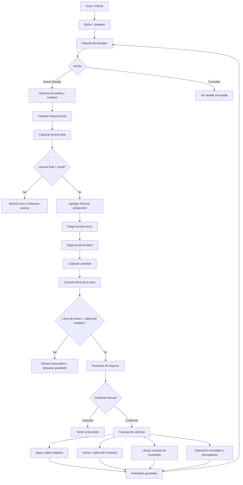

# Modelo visual previo: Llenado de producción

## Objetivo

Esta propuesta define la pantalla exclusiva del **vendedor de planta** para convertir envases vacíos y agua medida en productos terminados. No registra ventas, no cobra efectivo y no permite editar ni borrar operaciones confirmadas.

## Flujo visual

## Pantallas propuestas

### 1. Inicio de planta

La pantalla del vendedor debe mostrar una acción principal llamada **Llenados**. La acción debe estar separada de **Venta pública de planta**, porque una producción no representa una venta ni un movimiento de caja.

| Elemento | Función |
|---|---|
| **Llenados** | Abre el historial y el botón de nuevo llenado. |
| **Venta pública de planta** | Conserva el flujo actual de venta y caja; no se mezcla con llenados. |
| **Inventario resumido** | Muestra existencias de vacíos y llenos en modo lectura. |
| **Mi caja** | Muestra ventas y cobros; un llenado no debe aumentar la caja. |

### 2. Historial de llenados

La vista presenta únicamente operaciones de la planta asignada al vendedor y ordenadas de la más reciente a la más antigua.

| Botón o control | Visible | Función | Debe existir |
|---|---:|---|---:|
| **Nuevo llenado** | Sí | Inicia un borrador nuevo. | Sí |
| **Buscar** | Sí | Filtra por fecha, producto o identificador. | Sí |
| **Ver detalle** | Sí | Muestra lecturas, líneas y movimientos generados. | Sí |
| **Continuar borrador** | Condicional | Recupera un llenado abandonado localmente. | Sí |
| **Descartar borrador** | Condicional | Elimina solo el borrador local, nunca Firestore. | Sí |
| **Editar operación confirmada** | No | Las operaciones son inmutables. | No |
| **Eliminar operación** | No | Las operaciones son inmutables. | No |
| **Revertir operación** | No en esta etapa | Requeriría un flujo administrativo de reversa autorizado. | No |
| **Exportar** | No en esta etapa | Se definirá posteriormente para administración. | No |

### 3. Captura de llenado

La captura debe ser una pantalla o modal de varios pasos, no un formulario largo sin estados.

| Paso | Campo o botón | Comportamiento |
|---|---|---|
| Unidad | **Planta** | Se selecciona automáticamente si el vendedor tiene una sola planta; si tiene varias, debe elegir una. |
| Unidad | **Medidor** | Se carga desde la planta seleccionada y queda en solo lectura. |
| Lectura | **Lectura inicial** | Se propone la última lectura confirmada; no se puede disminuir. |
| Lectura | **Lectura final** | Acepta decimales según la configuración del medidor. Debe ser estrictamente mayor. |
| Lectura | **Salida calculada** | Se muestra como diferencia multiplicada por el factor configurado. No se edita manualmente. |
| Líneas | **Agregar presentación** | Añade una línea de producción. |
| Líneas | **Envase vacío** | Selecciona el SKU de vacío que disminuirá. |
| Líneas | **Producto lleno** | Selecciona el SKU terminado que aumentará. |
| Líneas | **Cantidad** | Acepta cantidades enteras o decimales según la unidad del SKU. |
| Líneas | **Litros por unidad** | Se obtiene del producto/configuración y se muestra en solo lectura. |
| Líneas | **Eliminar línea** | Solo elimina una línea del borrador local, antes de confirmar. |
| Resumen | **Validar llenado** | Comprueba lecturas, stock de vacíos y coincidencia de litros. |
| Resumen | **Confirmar llenado** | Ejecuta una única transacción idempotente. |
| Resumen | **Cancelar** | Regresa al borrador; pide confirmación si existen cambios. |

## Resumen de impacto antes de confirmar

Antes de guardar, el vendedor debe ver una síntesis explícita:

| Concepto | Ejemplo |
|---|---:|
| Lectura inicial | 100.000 |
| Lectura final | 138.000 |
| Salida del medidor | 38.000 L |
| Vacíos a descontar | 2 garrafones de 19 L |
| Productos llenos a sumar | 2 garrafones llenos de 19 L |
| Movimiento de caja | $0.00 |
| Cliente | No aplica |
| Estado posterior | Confirmado e inmutable |

## Estados de pantalla

| Estado | Mensaje o acción |
|---|---|
| Sin planta asignada | “No tienes una planta operativa asignada. Solicita configuración al administrador.” |
| Sin medidor | “La planta no tiene medidor configurado.” |
| Borrador vacío | “Agrega al menos una línea de producción.” |
| Lectura inválida | “La lectura final debe ser mayor que la inicial.” |
| Descuadre | “Las líneas suman X L y el medidor registra Y L.” |
| Stock insuficiente | “No hay suficientes envases vacíos para completar este llenado.” |
| Guardando | Botón deshabilitado y texto “Guardando llenado…” |
| Duplicado | Mostrar el resultado original mediante el `requestId`, sin crear movimientos nuevos. |
| Confirmado | Mostrar folio, fecha, lectura final y enlace a detalle. |
| Sin conexión | Guardar como borrador local; no mostrarlo como confirmado hasta sincronizar. |

## Funciones de botón que no deben existir

No debe haber botones para editar o eliminar operaciones, modificar lecturas confirmadas, cambiar el factor del medidor desde esta pantalla, convertir un llenado en venta, registrar efectivo, elegir un cliente o alterar manualmente los litros calculados.

> **Regla principal:** el llenado produce inventario; la venta produce caja. Son operaciones distintas y no deben compartir el mismo botón de confirmación.

## Criterio de aprobación visual

La pantalla podrá implementarse cuando se confirme que el flujo contiene, como mínimo, los botones **Llenados**, **Nuevo llenado**, **Agregar presentación**, **Eliminar línea del borrador**, **Validar llenado**, **Confirmar llenado**, **Cancelar**, **Continuar borrador**, **Descartar borrador** y **Ver detalle**; y que no contiene edición, eliminación o cobro dentro de una operación confirmada.
